# Introduction

The STM32 Nucleo Adapter Card is designed for effortless integration with the Nucleo-144 form factor board. Featuring 144 pin headers, it connects seamlessly to the STM32 Nucleo board without the need for any hardware modifications. Furthermore, it includes a MikroBUS interface that facilitates peripheral expansion.

This guide outlines the process for configuring the setup on STM32CubeIDE and executing Wi-Fi functionality  on the [NUCLEO-H745ZI-Q](https://www.st.com/en/evaluation-tools/nucleo-h745zi-q.html) using FreeRTOS. The tutorial specifically focuses on the example related to IF573.

# Hardware Setup

In the images provided, you can observe the [NUCLEO-H745ZI-Q](https://www.st.com/en/evaluation-tools/nucleo-h745zi-q.html) with a Nucleo-144 adapter on the left, alongside the STM32 Nucleo Adapter Card with the IF573 positioned on top of it on the right.

453-00119 (IF573, M2, SDIO) is plugged into M.2 slot.  

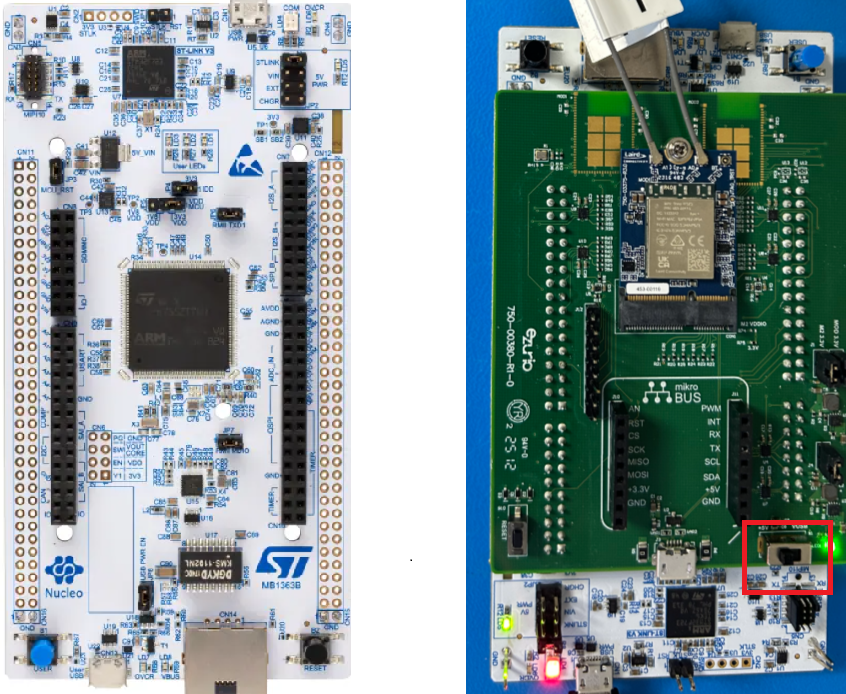

**Note:** Ensure that the power source is configured to **+5V**, as indicated in red above.

# Prerequisites

The following software needs to be installed:
- [STM32CubeMX](https://www.st.com/en/development-tools/stm32cubemx.html): For generating code by integrating firmware and packages.
- [STM32CubeIDE](https://www.st.com/en/development-tools/stm32cubeide.html): IDE for compiling, flashing, and debugging via ST-Link.
- [STM32CubeProgrammer](https://www.st.com/en/development-tools/stm32cubeprog.html): For flashing binary files onto STM32 boards.

# Updating Software

## STM32CubeMX: Installing Updates

Launch STM32CubeMX:

1. Navigate to **Help > Check for Updates**.

2. Refresh the list, select the new version, and click **Install**.  
	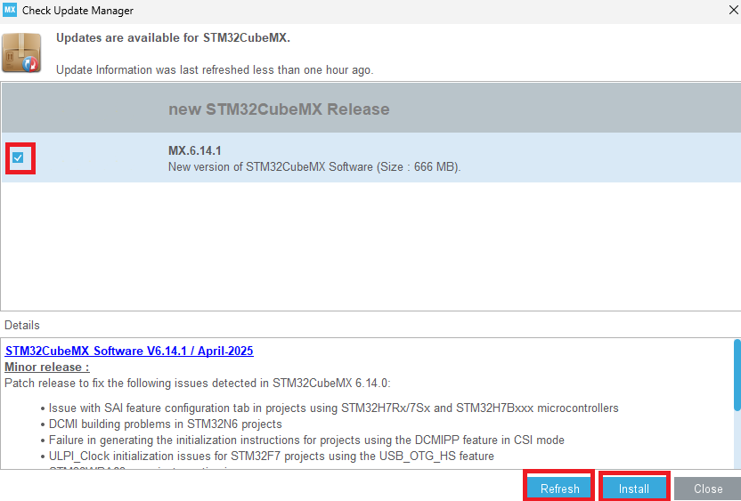 

# Install STM32 Connectivity Expansion Pack v1.7.1

1. Open STM32CubeMX and select **Install/Remove** under **Manage Software Installation**.   
	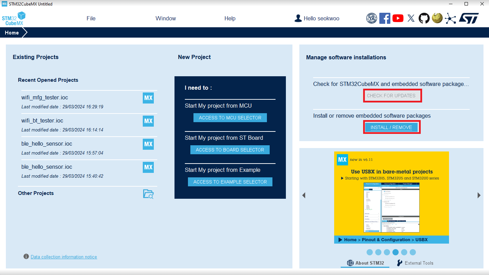
	
2. Click the **Infineon** tab, refresh, select version **1.7.1**, and click **Install**.   
	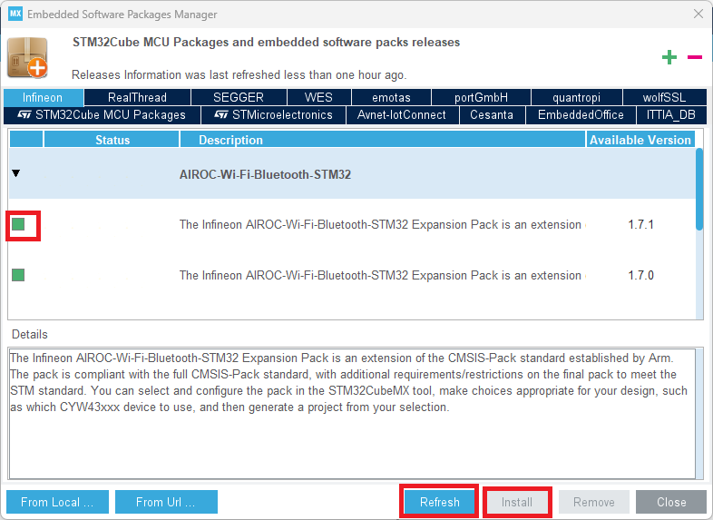
	
3. Close STM32CubeMX. 

# Configuring application with STM32CubeMX

## Open project in STM32CubeMX

1. Copy **wifi_bt_tester** from the repository:

   ```
	C:\Users\%USERNAME%\STM32Cube\Repository\Packs\Infineon\AIROC-Wi-Fi-Bluetooth-STM32\1.7.0\Projects\NUCLEO-H745ZI-Q\Applications
   ```
   
   to your personal directory:
   
   ```
   C:\Users\%USERNAME%\STM32Cube\Examples
   ```
   
2. Rename **`<application>\STM32CubeIDE`** to **`<application>\STM32CubeIDE.org`**.

3. Double-click `wifi_bt_tester.ioc` to open in STM32CubeMX.  
   Select **Migrate** if prompted.  
	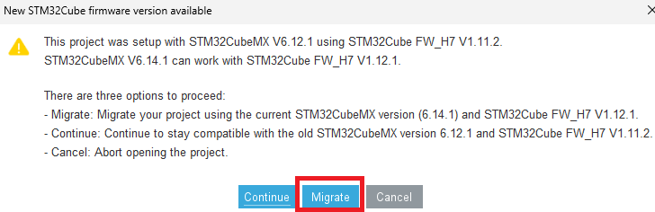
	
4. Under **Pinout & Configuration**, select **Software Packs > Select Components**.  
	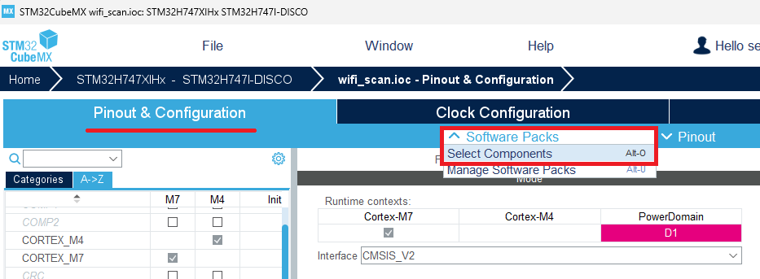

## Configuration

- Disable Bluetooth components (`btstack`, `btstack-integration`).

- Choose **CYW55572** as the device and **SONA-IF573** as the module.  
	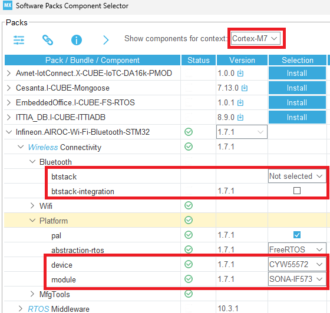
	
- Come back to Pinout page. Under **FREERTOS_M7 > Advanced settings**, enable **`USE_NEWLIB_REENTRANT`**.
	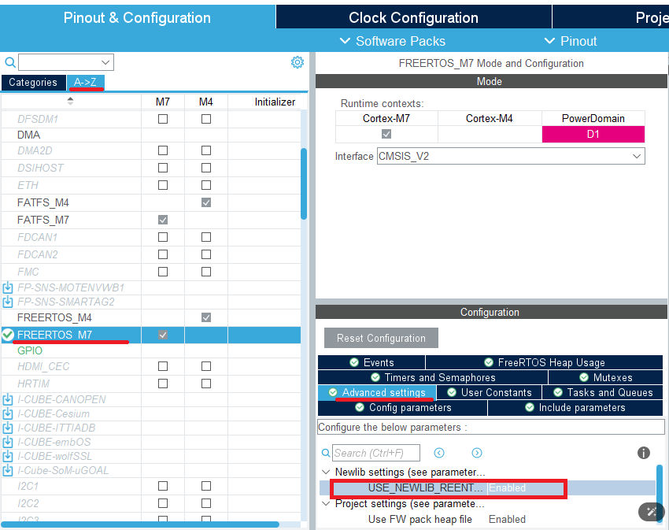

## Generate Code

Click **Generate Code** and open the project.  
	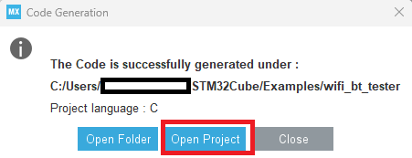

# Restore Original Linker Script
Once project is open in STM32CubeIDE, copy linker script from:

```
...\STM32CubeIDE.org\CM7\STM32XXXX_FLASH.ld
```

to:

```
...\STM32CubeIDE\CM7\STM32XXXX_FLASH.ld
```

# Building Application in STM32CubeIDE

## Modify source codes

Delete `bt_cfg.c` and `bt_utility` from:

```
wifi_bt_tester_CM7 > Middlewares > Connectivity > Wireless > MfgTools > command-console
```
  
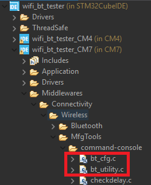

Modify `console_task.c` located at `Application > User > Core`:

Insert (Private macro section):

```c
#define SDMMC1_D0 PC8
#define SDMMC1_D1 PC9
#define SDMMC1_D2 PC10
#define SDMMC1_D3 PC11
```

Comment out:

```c
//bt_utility_init();
```

Add GPIO initialization code before the `stm32_cypal_wifi_sdio_init()` function:

```c
cyhal_gpio_init(SDMMC1_D0, CYHAL_GPIO_DIR_OUTPUT,CYHAL_GPIO_DRIVE_PULLUP, false);
cyhal_gpio_init(SDMMC1_D1, CYHAL_GPIO_DIR_OUTPUT,CYHAL_GPIO_DRIVE_PULLUP, false);
cyhal_gpio_init(SDMMC1_D2, CYHAL_GPIO_DIR_OUTPUT,CYHAL_GPIO_DRIVE_PULLUP, false);
cyhal_gpio_init(SDMMC1_D3, CYHAL_GPIO_DIR_OUTPUT,CYHAL_GPIO_DRIVE_PULLUP, false);
cyhal_system_delay_ms(10);
cyhal_gpio_write(SDMMC1_D0, true);
cyhal_gpio_write(SDMMC1_D1, true);
cyhal_gpio_write(SDMMC1_D2, true);
cyhal_gpio_write(SDMMC1_D3, true);
cyhal_system_delay_ms(10);
cyhal_gpio_free(SDMMC1_D0);
cyhal_gpio_free(SDMMC1_D1);
cyhal_gpio_free(SDMMC1_D2);
cyhal_gpio_free(SDMMC1_D3);
```

# Add Build Macro

1. Right-click `wifi_bt_tester_CM7`, select **Properties**.

2. In **C/C++ Build > Settings > MCU Settings**, enable **Use float**.  
	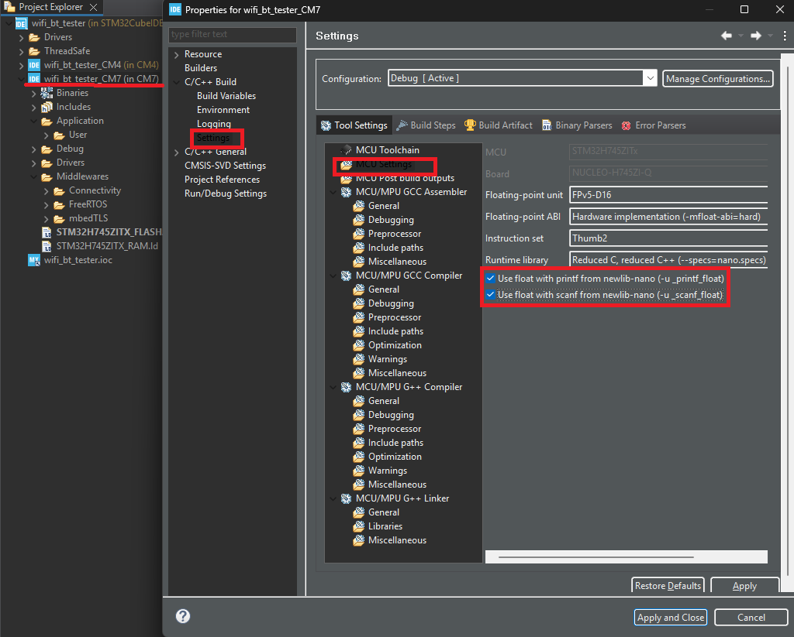
	
3. Under **C/C++ Build > MCU GCC Compiler > Preprocessor**, add macro `BLHS_SUPPORT`. Then apply and close.  
	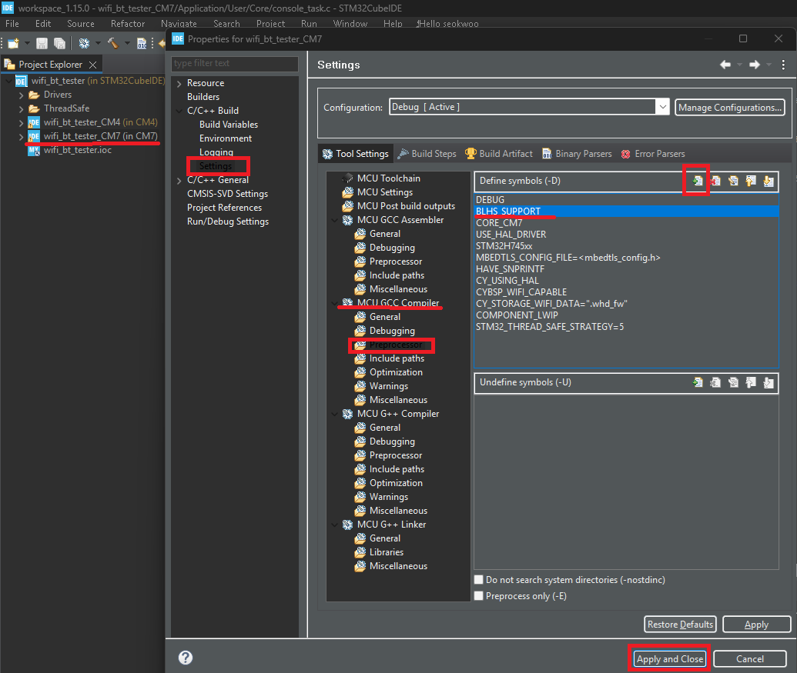
	
4. Right-click on `wifi_bt_tester_CM7` and select **Convert to C**.  
	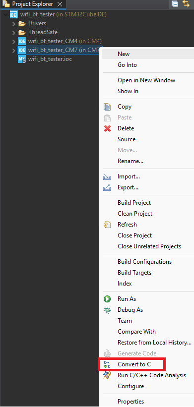

# Build Application

Build application (**Project > Build All**). 
 
	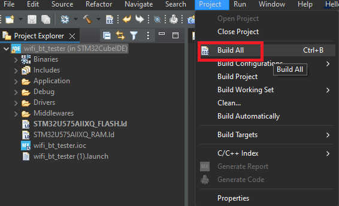

# Flash Application

Right-click `wifi_bt_tester_CM7`, select **Run As > STM32 C/C++ Application**.    
	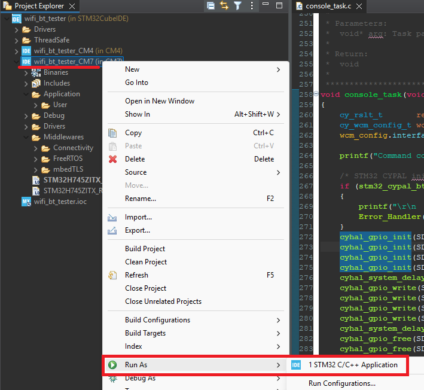

In **Edit Configuration**, confirm `Debug/wifi_bt_tester.elf` is selected, and click **OK**.  
	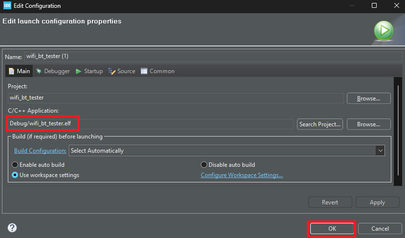
	
# Running Application

- Configure serial port and new-line receive to **AUTO**.  
	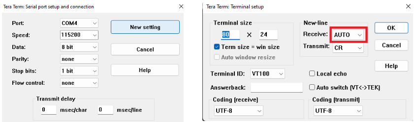
	
- Power cycle the board; Wi-Fi module initializes.  
	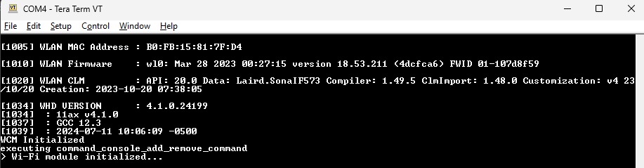
	
- Type `help` to list all available commands.  
	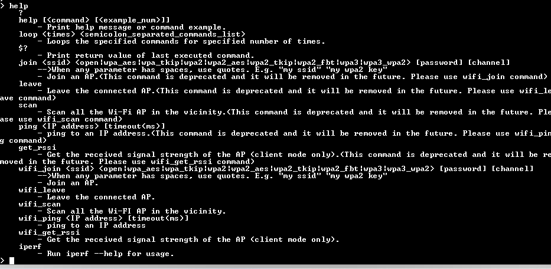
	
- For example, `scan` command scans for Wi-Fi network.
	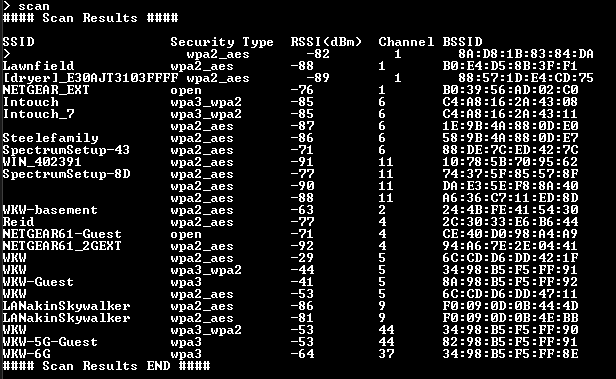
